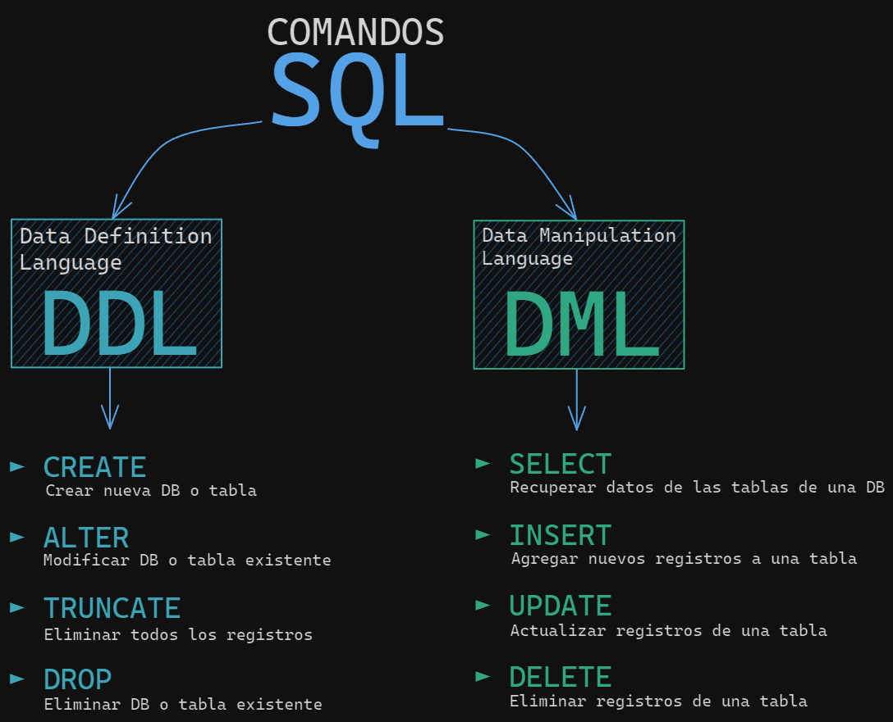
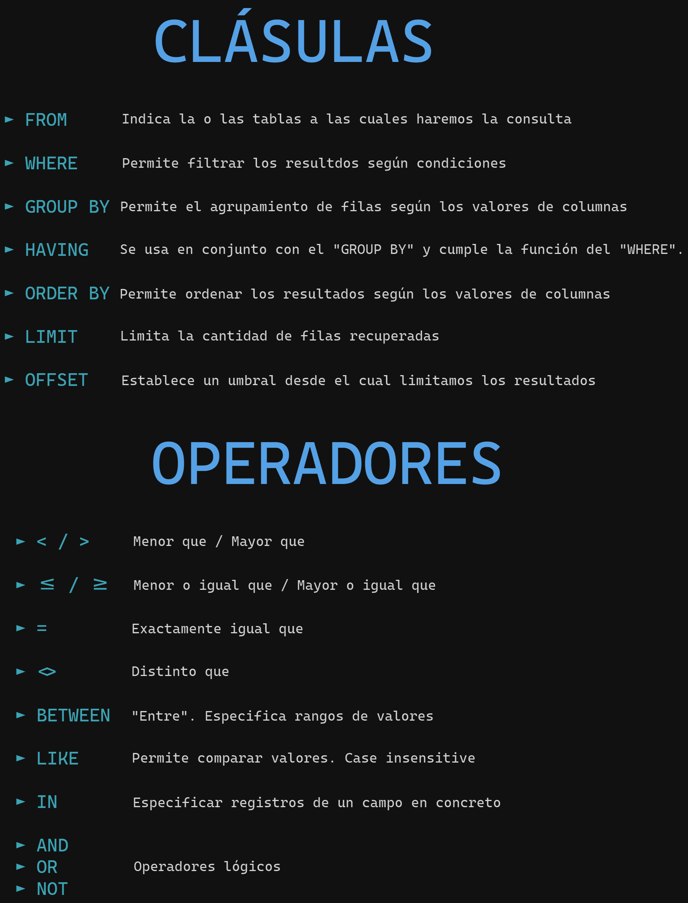

<h1 align="center"> BASES DE DATOS </h1>
<h3 align="center"> Normalización </h3>

Cuando analizamos bien en detalle todos los datos crudos que podrían conformar nuestra futura base de datos y los estructuramos de tal forma de reducir al mínimo la redundancia, siguiendo unos pasos bien definidos, estamos realizando el llamado proceso de **Normalización**.

#### Se trata de conectar los datos en la forma correcta.

El proceso de Normalización consta de 5 etapas, de las cuales las primeras tres forman parte del proceso básico, y las últimas dos de excepeciones. En la vasta mayoría de los casos, siguiendo los lineamientos de las tres primeras etapas obtenemos resultados satisfactorios.

Las tablas normalizadas son más fáciles de entender, de extender, de mejorar, y evitamos anomalías en la inserción, actualización y eliminación de datos.

#### 1NF | Eliminamos los grupos repetidos:

-   El orden en que se guardan los datos en las tablas no debe importar.
-   Cada campo sólamente debe tener un valor y cada columna debe contener valores del mismo tipo.
-   Cada nombre de columna debe de ser único.
-   Cada registro tiene que estar asociado a una **clave principal** o **Primary Key** **_(PK)_**.
-   No está permitido que haya grupos repetidos de datos.

#### 2NF | Eliminamos la redundancia de datos:

-   Cada registro debe depender de **solamente** una **PK**.
-   Cada atributo que no sea una llave, debe depender por completo de la **PK**. Es decir, no pueden haber dependencias parciales.

#### 3NF | Eliminamos los campos que no dependen de la PK:

-   Cada atributo de una tabla debe depender de una sola PK, de forma completa y no depender de ninguna otra cosa más.

Los valores de un registro que no forman parte de la clave de ese registro no pertenecen a la tabla. En general, siempre que el contenido de un grupo de campos pueda aplicarse a más de un único registro de la tabla, considere colocar estos campos en una tabla independiente.

Por ejemplo, en una tabla Contratación de empleados, puede incluirse el nombre de la universidad y la dirección de un candidato. Pero necesita una lista completa de universidades para enviar mensajes de correo electrónico en grupo. Si la información de las universidades se almacena en la tabla Candidatos, no hay forma de enumerar las universidades que no tengan candidatos en ese momento. Cree una tabla Universidades independiente y vincúlela a la tabla Candidatos con el código de universidad como clave.

<h3 align="center"> ¿Qué es SQL? </h3>

El nombre **SQL** está compuesto por las siglas en inglés de **_Structured Query Language_**, que significa **lenguaje estructurado de consultas**. Como su nombre lo indica, es un lenguaje que está pensado para interactuar con bases de datos relacionales de forma estructurada.

#### Sintaxis

<h1 align="center"> LINKS </h1>

-   [Introducción a la Normalzación de Datos](https://learn.microsoft.com/es-es/office/troubleshoot/access/database-normalization-description)
-   [Normalizando tablas](https://docs.google.com/spreadsheets/d/1BEsHfadPp5DB_aIZf9Rl5YKvzG-7jDp3cZzvbv9hnxo/edit?usp=sharing)
-   [SQL Interactivo](https://sqlbolt.com/)
